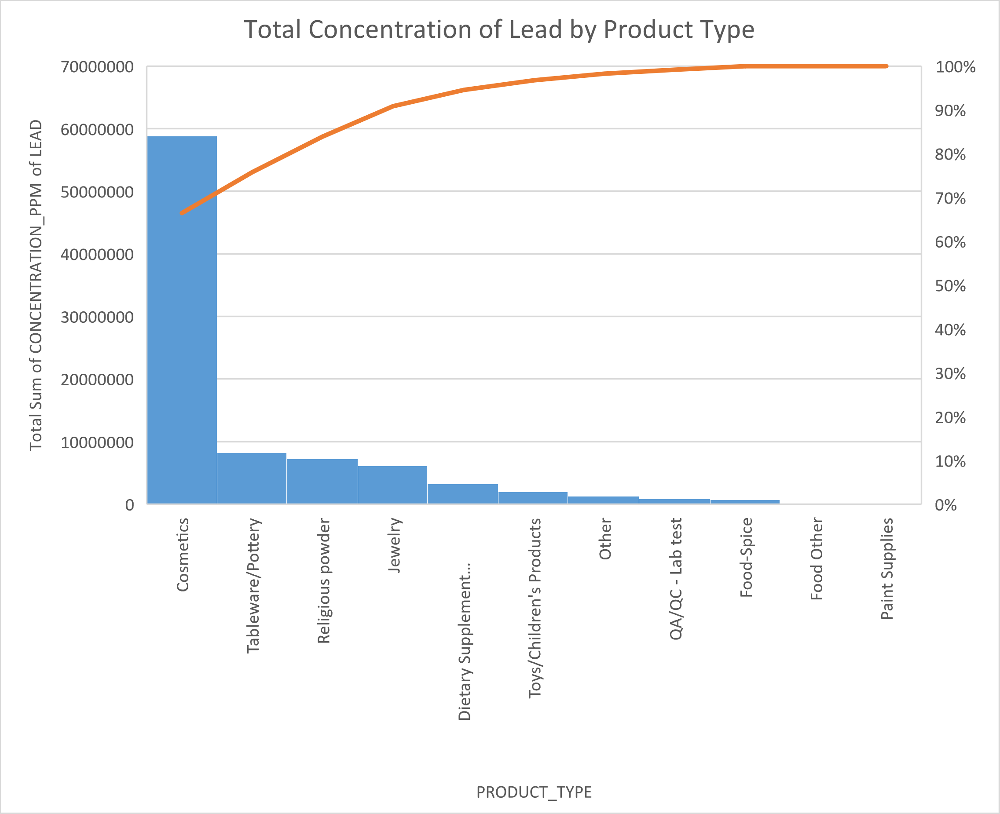

# Report of the data and the results

## Data Set Details

### Origin of the Data Set
The data set analyzed in this report  contains the laboratory 
results for the consumer products that are tested. It was sourced from the New York City Health Department, providing insights into various metals' prevalence (mainly lead) in consumer items.

Access the original data set here: [Metal Content of Consumer Products Tested by the NYC Health Department](https://data.cityofnewyork.us/Health/Metal-Content-of-Consumer-Products-Tested-by-the-N/da9u-wz3r)

### Format of the Original Data File
Luckily, the original data was provided in CSV format.

### Display of Raw Data
Below is an excerpt from the original data file, displaying the first 20 rows:

| ROW_ID | PRODUCT_TYPE               | PRODUCT_NAME            | METAL | CONCENTRATION | UNITS | MANUFACTURER                 | MADE_IN_COUNTRY        | COLELECTION_DATE          | DELETED |
|----|----------------------------|-------------------------|-------|---------------|-------|------------------------------|----------------|--------------------------|---------|
| 1  | Food-Spice                 | Turmeric powder         | Lead  | 2.9           | ppm   | UNKNOWN OR NOT STATED        | INDIA          | 2011 Jan 04 12:00:00 AM  |
| 2  | Food-Spice                 | Cumin powder            | Lead  | 2.4           | ppm   | UNKNOWN OR NOT STATED        | INDIA          | 2011 Jan 04 12:00:00 AM  |
| 3  | Food-Spice                 | Cumin seeds             | Lead  | 2.8           | ppm   | UNKNOWN OR NOT STATED        | INDIA          | 2011 Jan 04 12:00:00 AM  |
| 4  | Food-Spice                 | Masala                  | Lead  | 12            | ppm   | UNKNOWN OR NOT STATED        | UNKNOWN OR NOT STATED | 2011 Jan 04 12:00:00 AM  |
| 5  | Food-Candy                 | Tamarind Candy          | Lead  | -1            | ppm   | UNKNOWN OR NOT STATED        | UNKNOWN OR NOT STATED | 2011 Jan 06 12:00:00 AM  |
| 6  | Food-Candy                 | Lucas Muecas candy      | Lead  | -1            | ppm   | Lucas Muecas                 | MEXICO         | 2011 Jan 06 12:00:00 AM  |
| 7  | Jewelry                    | Amulet (Tabeez)         | Lead  | 580000        | ppm   | UNKNOWN OR NOT STATED        | BANGLADESH     | 2011 Jan 13 12:00:00 AM  |
| 8  | Jewelry                    | String for amulet/tabeez| Lead  | -1            | ppm   | UNKNOWN OR NOT STATED        | BANGLADESH     | 2011 Jan 13 12:00:00 AM  |
| 9  | Cosmetics                  | Surma (Hashmi)          | Lead  | 410000        | ppm   | UNKNOWN OR NOT STATED        | PAKISTAN       | 2011 Jan 19 12:00:00 AM  |
| 10 | Food-Spice                 | Powdered red pepper     | Lead  | -1            | ppm   | UNKNOWN OR NOT STATED        | INDIA          | 2011 Jan 19 12:00:00 AM  |
| 11 | Food-Spice                 | Turmeric (Haldi)        | Lead  | -1            | ppm   | UNKNOWN OR NOT STATED        | INDIA          | 2011 Jan 19 12:00:00 AM  |
| 12 | Food-Spice                 | Garam masala            | Lead  | 3.2           | ppm   | UNKNOWN OR NOT STATED        | INDIA          | 2011 Jan 19 12:00:00 AM  |
| 13 | Food-Spice                 | Garam masala            | Lead  | 3.8           | ppm   | UNKNOWN OR NOT STATED        | INDIA          | 2011 Jan 19 12:00:00 AM  |
| 14 | Food-Spice                 | Red pepper spice        | Lead  | -1            | ppm   | UNKNOWN OR NOT STATED        | UNKNOWN OR NOT STATED | 2011 Jan 19 12:00:00 AM  |
| 15 | Food-Spice                 | Turmeric powder         | Lead  | 610           | ppm   | UNKNOWN OR NOT STATED        | BANGLADESH     | 2011 Jan 21 12:00:00 AM  |
| 16 | Food-Spice                 | Chili powder            | Lead  | 3.8           | ppm   | UNKNOWN OR NOT STATED        | BANGLADESH     | 2011 Jan 21 12:00:00 AM  |
| 17 | Dietary Supplement/Medications/Remedy | Pregnita (Ayurvedic)    | Lead  | 12000         | ppm   | Ajmera Pharmaceuticals PVT. LTD. | INDIA          | 2011 Jan 24 12:00:00 AM  |
| 18 | Dietary Supplement/Medications/Remedy | Calcimax 500            | Lead  | 2.7           | ppm   | Meyer Vitabiotics                | INDIA          | 2011 Jan 24 12:00:00 AM  |
| 19 | Food-Spice                 | Turmeric                | Lead  | 1.5           | ppm   | UNKNOWN OR NOT STATED        | UNKNOWN OR NOT STATED | 2011 Jan 24 12:00:00 AM  |

### Problems and Data Munging
In transforming the original data file into clean data, I removed unneeded rows and columns and created new columns for computed data. Additionally, I identified issues within the data which are specified below along with the code used to address them.

1. **Remove 'DELETED' Column and empty rows:** The 'DELETED' column, containing no valuable information, was deleted from the dataset. Since I found there was no column details in the 'Data Dictionary' attachment from the original website,it indicates the irrelevance to data analysis.
    ```python
    cleaned_data = data.drop(columns=['DELETED'])
    ```

    Furthermore, rows that were empty were also removed to ensure data consistency and relevance.

    ```python
    cleaned_data = cleaned_data.dropna()
    ```

2. **Standardize Date Format:** The original datetime format (e.g., '2011 Jan 24 12:00:00 AM') was converted to a more commonly used format (e.g., '2011-01-24'). This standardization can make analysis and comparison of dates easier.
    ```python
    cleaned_data['COLLECTION_DATE'] = pd.to_datetime(cleaned_data['COLLECTION_DATE']).dt.date
    ```

3. **Handling '-1' Values in 'CCONCENTRATION' Column:** When inspecting the data, I noticed many entries in the 'CONCENTRATION' column were marked as '-1', which seems to be logically incorrect . A significant number of products were marked as '-1' as well. Instead of deleting these rows, I referred to the 'Data Dictionary', which indicated that a value of '-1' means not detected in labotory.
    >'Value is numerical. Sample with a metal concentration below the laboratory reporting limit is marked "-1", meaning "Not Detected".'

    So I decided to keep these entries in the cleaned data. To facilitate subsequent analysis, I created a new boolean column to record whether the concentration was marked as '-1':

    ```python
    cleaned_data['CONCENTRATION_IS_NEGATIVE_ONE'] = data['CONCENTRATION'] == -1
    ```

4. **Standardizing Units in 'UNITS' Column:** In the dataset, the 'UNITS' column contains a variety of values, with most being 'ppm'. However, there are entries listed as 'MG/L', 'MG/KG-DRY', and 'MG/CM^2'. The 'Data Dictionary' provided no more clarification on these units, so I decided to define a method to convert them. Under the assumption that the those products using mg/L as units have the same density of water, which means 1mg/L equals 1 ppm, I converted these values accordingly. However, due to the significant variation in solid densities, converting 'MG/CM^2' to ppm would require extensive effort and is dependent on the specific substance being measured. Therefore, I opted to set these values as 'None' for the time being. Those values converted are stored in a new column. Below is a snippet of the code used for unit conversion:

    ```python
    def convert_to_ppm(value, unit):
        if unit == 'MG/L':
            return value
        ...
    ```


### Links to Data Files
- [Original Raw Data](data/Metal_Content_of_Consumer_Products_Tested_by_the_NYC_Health_Department_20240217.csv)
- [Munged Data](data/clean_data.csv)
- [Final Spreadsheet](data/MetalContent.xlsx)

## Analysis

### Description of aggregate statistics

The initial set of aggregate statistics (N2-Q2 in [the spreadsheet](data/MetalContent.xlsx)) — average, maximum, minimum, and total concentrations of **_lead only_** values, excluding the "-1" (non-detected), provide an overview of lead contamination across all product categories. By calculating the average lead concentration, we get an insight of the typical level of lead presence, showing us what consumers might regularly encounter. The maximum concentration highlights the most extreme concentration cases, telling us the upper limits of lead exposure that could pose significant health risks. The minimum value, while excluding non-detections, reflects the lowest level of detectable lead, giving a baseline of concentration. The total sum, on the other hand, aggregates all detectable lead levels. These statistics reveal patterns and outliers in the data that are not immediately evident from raw figures.

Specific to the **_Food-Spices_** category, the same set of statistics (N5-Q5 in [the spreadsheet](data/MetalContent.xlsx)) reveal unique risk characteristics for the category. The average concentrations for food-spices reflect the prevalence of lead contamination in cooking products, which can have serious dietary safety implications. Maximum values in this category indicate the highest levels of contamination in spices, identifying specific products that may require further inspection or immediate action. Meanwhile, the minimum concentrations tell us about lower levels of contamination, thus guiding consumers to make safer choices. Finally, the total concentration in food condiments summarizes the cumulative lead exposure potential of these products, emphasizing the importance of monitoring and regulating dietary lead levels to protect public health.

### Pivot table
| Types of Product/Made in Different Countries | Average of CONCENTRATION_PPM | Sum of CONCENTRATION_PPM | Total Average of CONCENTRATION_PPM | Total Sum of CONCENTRATION_PPM |
|----------------------------------------------|------------------------------|--------------------------|------------------------------------|-------------------------------|
| **Cosmetics**                                | 350094.6115                  | 58465800.13              | 350094.6115                        | 58465800.13                   |
| AFGHANISTAN                                  | 763333.3333                  | 2290000                  | 763333.3333                        | 2290000                       |
| BANGLADESH                                   | 4.406666667                  | 13.22                    | 4.406666667                        | 13.22                         |
| CHINA                                        | 1.433333333                  | 3.43                     | 1.143333333                        | 3.43                          |
| FRANCE                                       | 0.58                         | 0.58                     | 0.58                               | 0.58                          |

Insights from the pivot table includes:

**Geographic Decision-making:** Consumers may be more careful when choosing cosmetics originating from areas showing high lead concentrations like Afghanistan, Gambia, and Ghana. Awareness of product origin can become a critical factor in purchase decisions.

**Regulatory Focus:** Regulatory bodies might use this data to prioritize inspections in regions identified with high concentrations. This targeted approach could lead to better resource allocation.

**Product-Specific Considerations:** The high lead values observed may due to certain product types known to contain higher lead levels. Both consumers and regulators should be aware of this to make informed decisions.

**Sample Size and Data Representation:** It's important to note that some totals are only slightly higher than the averages, indicating small sample sizes for certain regions or products. This means a larger dataset would provide a more accurate representation.


### Chart Analysis


The chart above shows the total lead content of each product category. It is noteworthy that "cosmetics" have significantly higher lead levels compared to the other categories. This is a worrying trend, especially given the direct contact of cosmetics with the skin.

In addition to this, the categories "Jewelry" and "Dietary Supplements" also show significant concentrations that warrant further investigation.

This visualization suggests that we need to focus on the high-risk categories of cosmetics and jewelry for immediate action.
